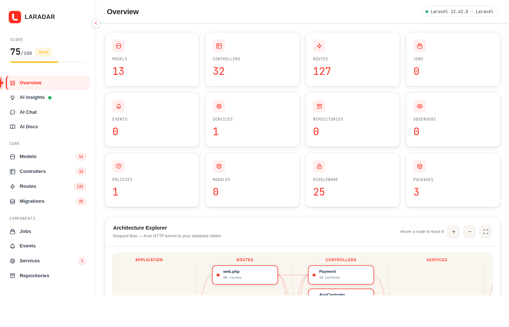
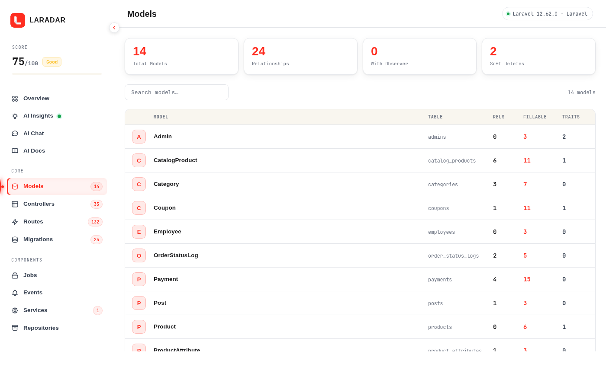
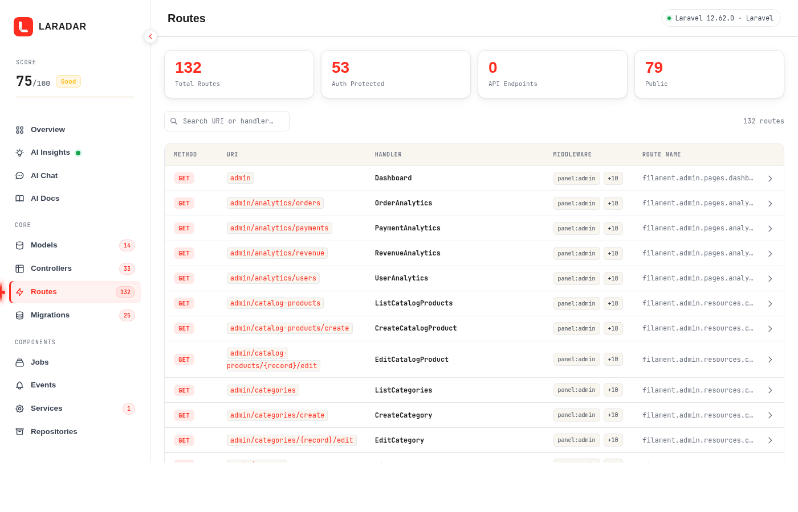

# Laradar

[](https://packagist.org/packages/vcian/laradar)
[](https://packagist.org/packages/vcian/laradar)
[](LICENSE)
[](https://www.php.net)
[](https://laravel.com)

Automatically **discover, visualize, and document** your Laravel application architecture — without writing a single line of configuration.

## Screenshots







- Interactive dashboard with architecture overview, flowchart, and route explorer
- Scans models, controllers, routes, jobs, events, services, repositories, observers, policies, middleware, modules, and packages
- Optional **AI-powered architecture review** (OpenAI, Anthropic, Gemini, Groq, Mistral, Ollama, OpenRouter)

---

## Requirements

| Dependency | Version |
|---|---|
| PHP | ^8.1 |
| Laravel | 10, 11, 12, or 13 |

---

## Installation

```bash
composer require vcian/laradar
```

Publish the config file:

```bash
php artisan vendor:publish --tag=laradar-config
```

---

## Interactive Dashboard

Visit `/laradar` in your browser (only available when `APP_ENV=local` or `APP_ENV=development` by default):

```
http://your-app.test/laradar
```

The dashboard provides:
- **Overview** — component counts, architecture score, health checks, and architecture flowchart
- **Models** — relationships, fillable fields, table mappings
- **Controllers** — methods, route bindings, dependencies
- **Routes** — full route list with methods, middleware, and controllers
- **Migrations** — all migration files with table name, operation (create/modify/drop), columns, types, and foreign keys
- **Jobs / Events / Services / Repositories / Observers / Policies / Middleware / Modules / Packages** — per-component explorer
- **AI Insights** — AI-powered review of your architecture (requires AI config)

---

## Artisan Command

Generate reports from the command line:

```bash
# Generate all formats (json, html, markdown)
php artisan laradar:scan

# Generate specific formats
php artisan laradar:scan --format=html
php artisan laradar:scan --format=json
php artisan laradar:scan --format=markdown
```

Reports are saved to `storage/architecture/`. After scanning, the HTML report is also accessible in the browser at:

```
http://your-app.test/laradar/report
```

---

## Configuration

```php
// config/laradar.php

return [
    'dashboard' => [
        'enabled'    => true,
        'path'       => 'laradar',         // URL path
        'middleware' => ['web'],
    ],

    'scan' => [
        'models'       => true,
        'controllers'  => true,
        'routes'       => true,
        'migrations'   => true,
        'jobs'         => true,
        'events'       => true,
        'services'     => true,
        'repositories' => true,
        'observers'    => true,
        'policies'     => true,
        'modules'      => true,
        'packages'     => true,
    ],

    // AI analysis (optional)
    'ai' => [
        'enabled'  => env('AI_ENABLED', false),
        'provider' => env('AI_PROVIDER', 'gemini'),
    ],
];
```

---

## AI Analysis

Add to your `.env`:

```env
AI_ENABLED=true

# Choose one provider:

# Google Gemini
AI_PROVIDER=gemini
GEMINI_API_KEY=your-key
GEMINI_MODEL=gemini-2.0-flash

# OpenAI
AI_PROVIDER=openai
OPENAI_API_KEY=your-key
OPENAI_MODEL=gpt-4o-mini

# Anthropic Claude
AI_PROVIDER=anthropic
ANTHROPIC_API_KEY=your-key
ANTHROPIC_MODEL=claude-3-5-haiku-20241022

# Groq (fast & free tier)
AI_PROVIDER=groq
GROQ_API_KEY=your-key
GROQ_MODEL=llama-3.3-70b-versatile

# Mistral
AI_PROVIDER=mistral
MISTRAL_API_KEY=your-key
MISTRAL_MODEL=mistral-small-latest

# Ollama (local)
AI_PROVIDER=ollama
OLLAMA_MODEL=llama3
OLLAMA_BASE_URL=http://localhost:11434/v1

# OpenRouter (200+ models, free tier available)
AI_PROVIDER=openrouter
OPENROUTER_API_KEY=your-key
OPENROUTER_MODEL=openrouter/auto       # auto-selects best available model
```

---

## What Gets Scanned

| Component | What is detected |
|---|---|
| **Models** | Table, fillable, hidden, casts, relationships, observers |
| **Controllers** | Methods, route bindings, dependencies |
| **Routes** | URI, method, middleware, name, controller |
| **Jobs** | Queue connection, class hierarchy |
| **Events** | Listeners, broadcast channels |
| **Services** | Service classes in `App\Services` |
| **Repositories** | Repository classes in `App\Repositories` |
| **Observers** | Observed models, event hooks |
| **Policies** | Guarded models, defined abilities |
| **Migrations** | Migration files, table operations, column types, foreign keys |
| **Middleware** | Registered middleware and aliases |
| **Modules** | Module detection from `Modules/` directory |
| **Packages** | Installed Composer packages with version info |

---

## License

MIT — see [LICENSE](LICENSE) for details.
